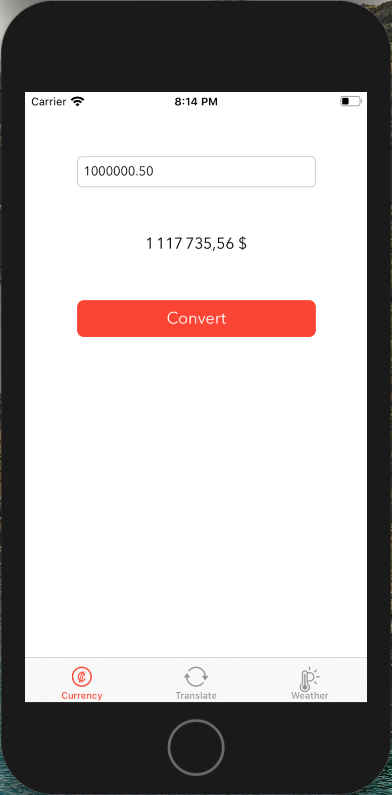
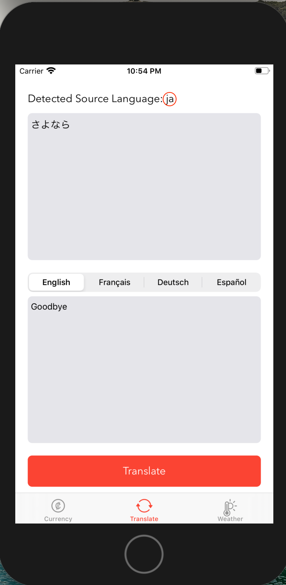
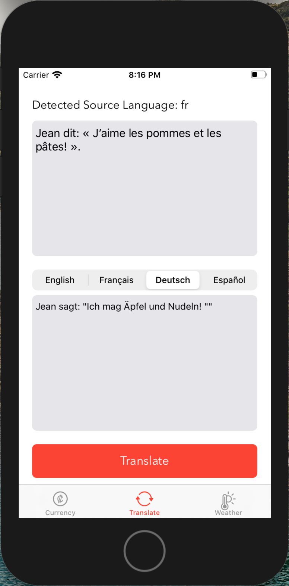
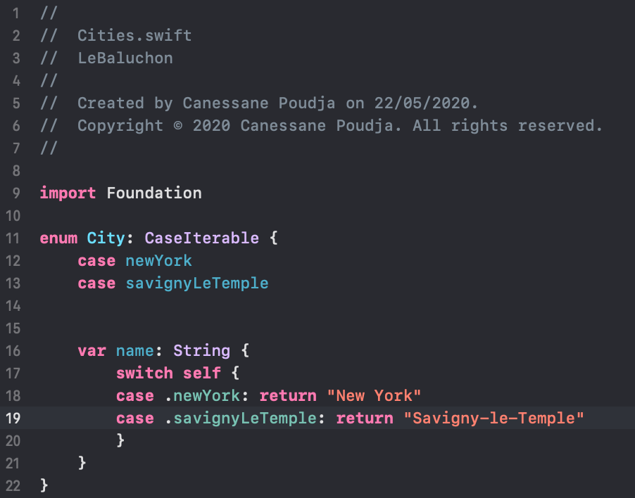
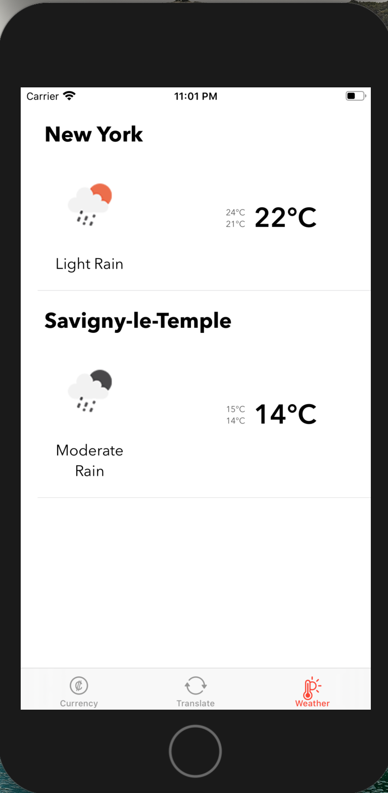
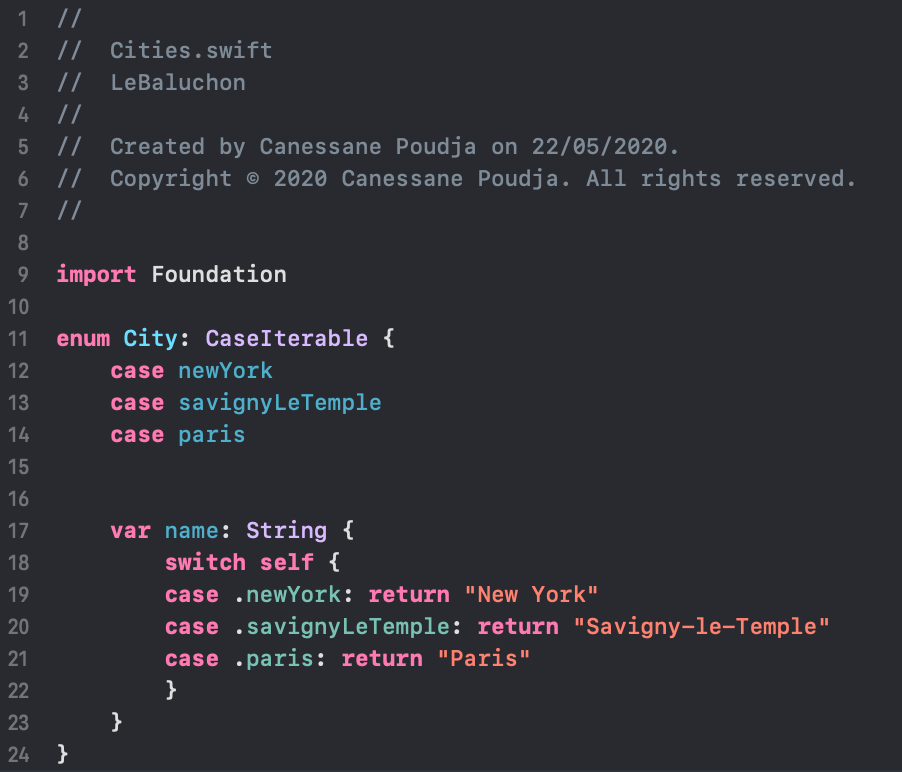
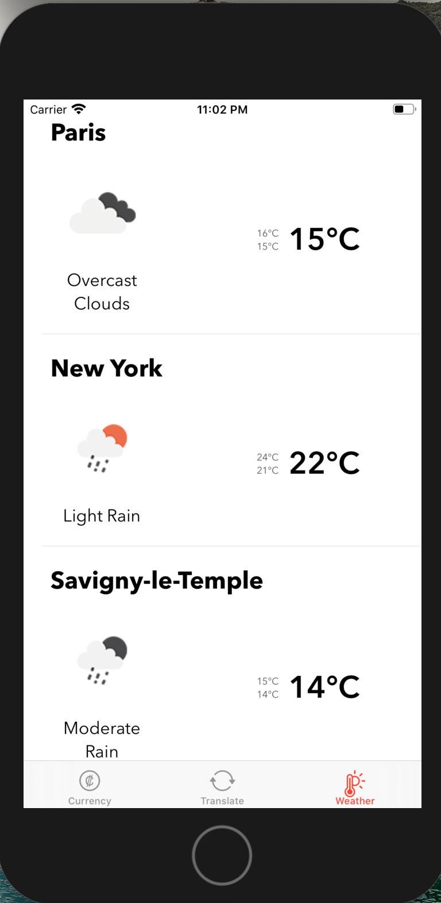

# Le Baluchon
This project is the sixth of the iOS Developer path from OpenClassrooms.  
It is a 3 page app so I used a Tab Bar for the navigation. There is at least 1 network call on each page.

This app is:

- responsive in all iPhones in portrait mode,
- available from iOS 11,
- conform to MVC,
- covered by unit tests.

## Currency
We can get the exchange rate between euro (€) and dollar ($) thanks to the [fixer.io](https://fixer.io/) API.

## Translation
Due to the [Google Translate](https://cloud.google.com/translate/docs/) API we can translate any language into one of these 4 target languages: 
- English,
- French, 
- German,
- Spanish.

Moreover the source language is automatically detected.

  

## Weather
We can get the weather of any city using the [OpenWeathermap](https://openweathermap.org/current) API. We just have to add a case in the City enum and specify its name property.

 

 
